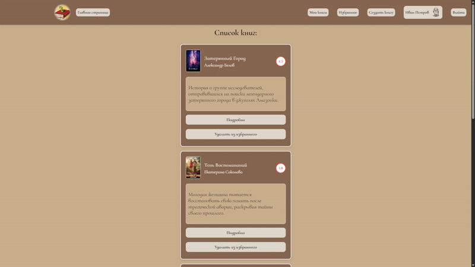
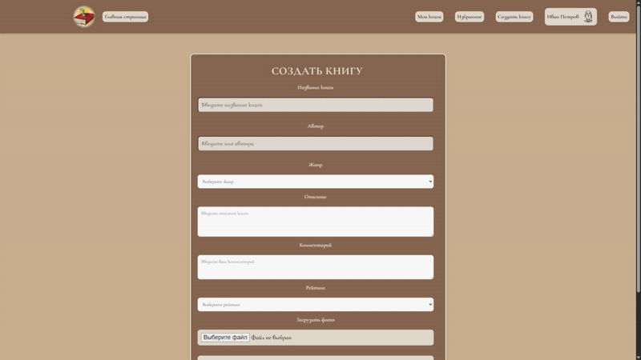
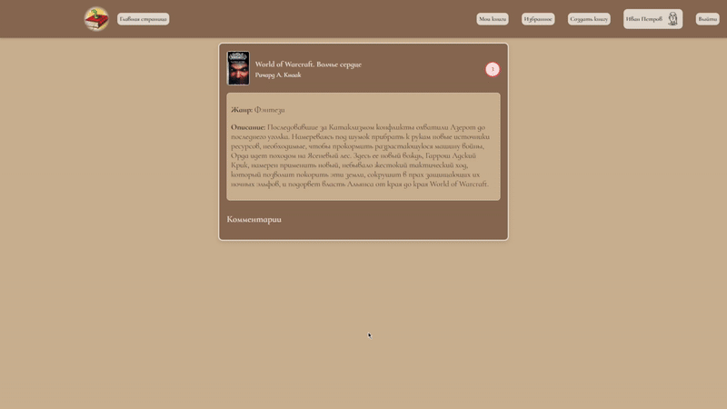
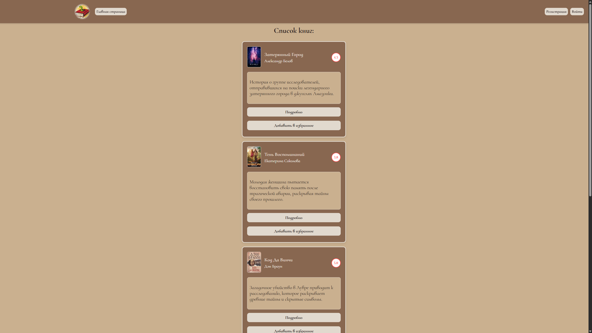
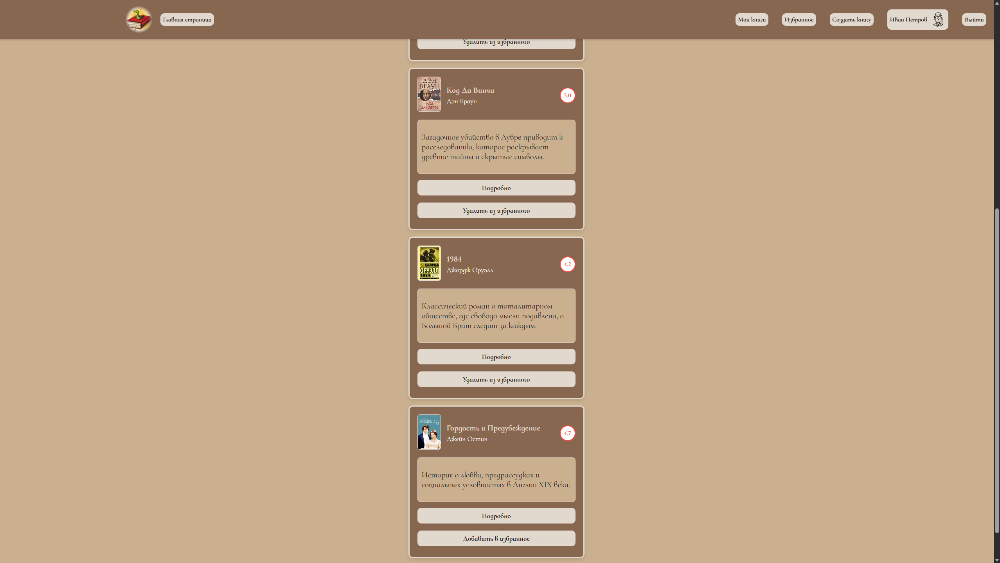

# Bookworm - Онлайн-библиотека

<div style="display: flex;">
    
    
    
    
    
</div>

## Описание

Bookworm - это веб-приложение для онлайн-библиотеки, позволяющее пользователям просматривать каталог книг, добавлять их в избранное, оставлять комментарии и создавать собственные книги.

**Основные возможности:**

*   **Просмотр каталога:** Открытый доступ к полному каталогу книг.
*   **Авторизация и регистрация:** Пользователи могут создавать аккаунты и входить в систему.
*   **Личный кабинет:**
    *   Страница "Мои книги": Список книг, созданных пользователем.
    *   Страница "Избранное": Список книг, добавленных в избранное.
    *   Страница "Профиль": Просмотр профиля пользователя.
*   **Создание книг:** Авторизованные пользователи могут добавлять новые книги в каталог.
*   **Детальная информация:** Страница каждой книги содержит:
    *   Фото обложки (с модальным окном для увеличения)
    *   Название
    *   Автор
    *   Описание
    *   Рейтинг
    *   Кнопки "Подробнее" и "Добавить/Удалить из избранного".
    *   Комментарии (доступны для чтения и при создании книги).

## Технологии

*   **Клиент (Frontend):**
    *   React.js
    *   React Router DOM
    *   Axios
    *   bcrypt
    *   email-validator
    *   Vite

*   **Сервер (Backend):**
    *   Node.js
    *   Express.js
    *   PostgreSQL
    *   Sequelize
    *   bcrypt
    *   cookie-parser
    *   cors
    *   dotenv
    *   jsonwebtoken
    *   morgan
    *   multer

## Требования

*   Наличие установленной СУБД PostgreSQL на устройстве.

## Настройка и запуск

1.  **Клонируйте репозиторий:**
    ```bash
    git clone [URL вашего репозитория]
    cd [название директории репозитория]
    ```

2.  **Настройте переменные окружения:**
    *   Создайте файл `.env` в корне проекта.
    *   Заполните его, используя пример из `env.example` (как для сервера, так и для клиента, строго соблюдая формат).

3.  **Установите зависимости:**
    ```bash
    npm install # (для сервера и клиента)
    ```

4.  **Настройте и запустите базу данных:**
    ```bash
    npm run db:reset # (для сервера)
    ```

5.  **Запустите приложение в режиме разработки:**
    ```bash
    npm run dev # (для сервера и клиента)
    ```

6.  **Откройте приложение в браузере:**
    Перейдите по адресу `http://localhost:5173`

## Авторизация для тестирования

*   **Email:** `ivan.petrov@example.com`
*   **Пароль:** `qwerty123`
